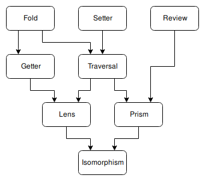

Optics
======

Lenses are just one in a whole family of related objects called
*optics*. Optics generalise the notion of accessing data.

The heirarchy of optics looks like this:

An arrow pointing from A to B here means that all B are also A. For
example, all Lenses are also Getters, and all Getters are also Folds.

When we compose two optics together, the result is the most-recent
common ancestor of the two. For example, if we compose a Getter and a
Traversal then the optic we get back would be a Fold because Getters and
Traversals are both kinds of Fold. We cannot compose two optics that do
not share a common ancestor; e.g. we cannot compose a Fold with a Setter.

You can find out the kind of a lens using the ``kind`` method:

>>> from lenses import lens

>>> my_lens = lens[0]
>>> my_lens.kind()
'Lens'
>>> my_prism = lens.Instance(str)
>>> my_prism.kind()
'Prism'
>>> my_traversal = my_lens & my_prism
>>> my_traversal.kind()
'Traversal'

Traversals
----------

All the optics that we have seen so far have been lenses, so they always
focused a single object inside a state. But it is possible for an optic
to have more than one focus. One such optic is the traversal. A simple
traversal can be made with the ``Both`` method. ``lens.Both()`` focuses
the two objects at indices ``0`` and ``1`` within the state. It is intended
to be used with tuples of length 2, but will work on any indexable object.

One issue with multi-focus optics is that the ``get`` method only ever
returns a single focus. It will return the *first* item focused by the
optic. If we want to get all the items focused by that optic then we
can use the ``collect`` method which will return those objects in a list:

>>> data = [0, 1, 2, 3]
>>> both = lens.Both()
>>> both.get()(data)
0
>>> both.collect()(data)
[0, 1]

Setting works with a traversal, though all foci will be set to the same
object.

>>> both.set(4)(data)
[4, 4, 2, 3]

Modifying is the most useful operation we can perform. The modification
will be applied to all the foci independently. All the foci must be of
the same type (or at least be of a type that supports the modification
that we want to make).

>>> both.modify(lambda a: a + 10)(data)
[10, 11, 2, 3]
>>> both.modify(str)([0, 1.0, 2, 3])
['0', '1.0', 2, 3]

You can of course use the same shortcut for operators that single-focus
lenses allow:

>>> (both + 10)(data)
[10, 11, 2, 3]

Traversals can be composed with normal lenses. The result is a traversal
with the lens applied to each of its original foci:

>>> data = [[0, 1], [2, 3]]
>>> both_then_zero = lens.Both()[0]
>>> both_then_zero.collect()(data)
[0, 2]
>>> (both_then_zero + 10)(data)
[[10, 1], [12, 3]]

Traversals can also be composed with other traversals just fine. They
will simply increase the number of foci targeted. Note that ``collect``
returns a flat list of foci; none of the structure of the state is
preserved.

>>> both_twice = lens.Both().Both()
>>> both_twice.collect()(data)
[0, 1, 2, 3]
>>> (both_twice + 10)(data)
[[10, 11], [12, 13]]

A slightly more useful traversal method is ``Each``. ``Each`` will focus
all of the items in a data-structure analogous to iterating over it
using python's ``iter`` and ``next``. It supports most of the built-in
iterables out of the box, but if we want to use it on our own objects
then we will need to add a hook explicitly.

>>> data = [1, 2, 3]
>>> (lens.Each() + 10)(data)
[11, 12, 13]

The ``Values`` method returns a traversal that focuses all of the values
in a dictionary. If we return to our ``GameState`` example from earlier,
we can use ``Values`` to move *every* enemy in the same level 1 pixel
over to the right in one line of code:

>>> from collections import namedtuple
>>>
>>> GameState = namedtuple('GameState',
...     'current_world current_level worlds')
>>> World = namedtuple('World', 'theme levels')
>>> Level = namedtuple('Level', 'map enemies')
>>> Enemy = namedtuple('Enemy', 'x y')
>>>
>>> data = GameState(1, 2, {
...     1: World('grassland', {}),
...     2: World('desert', {
...         1: Level({}, {
...             'goomba1': Enemy(100, 45),
...             'goomba2': Enemy(130, 45),
...             'goomba3': Enemy(160, 45),
...         }),
...     }),
... })
>>>
>>> level_enemies_right = (lens.worlds[2]
...                            .levels[1]
...                            .enemies.Values().x + 1)
>>> new_data = level_enemies_right(data)

Or we could do the same thing to every enemy in the entire game
(assuming that there were other enemies on other levels in the
``GameState``):

>>> all_enemies_right = (lens.worlds.Values()
...                          .levels.Values()
...                          .enemies.Values().x + 1)
>>> new_data = all_enemies_right(data)

Getters
-------

A Getter is an optic that knows how to retrieve a single focus from a
state. You can think of a Getter as a Lens that does not have a setter
function. Because it does not have a setter function, we cannot use a
Getter to ``set`` values. You also cannot use ``modify``, ``call``, or
``call_mut`` because these all make use of the setting machinery. The
only method we can meaningly perform on a Getter is ``get``. We can call
``collect``, but it will always give us a list containing a single focus.

The simplest way to make a Getter is with the ``F`` method. This method
takes a function and returns a Getter that just calls that function on
the state in order and whatever that function returns is the focus.

>>> data = 1
>>> def get_negative(state):
...     return -state
>>> neg_getter = lens.F(get_negative)
>>> neg_getter.get()(data)
-1

If we try to call ``set`` or any other invalid method on a Getter then
we will get an exception:

>>> neg_getter.set(2)(data)
Traceback (most recent call last):
  File "<stdin>", line 1, in ?
TypeError: Must be an instance of Setter to .set()

You might notice that ``lens.F(some_function).get()`` is exactly equivalent
to using ``some_function`` by itself. For this reason Getters on their
own are not particularly useful. The utility of Getters comes when we
compose them with other optics.

>>> data = [1, 2, 3]
>>> each_neg = lens.Each().F(get_negative)
>>> each_neg.collect()(data)
[-1, -2, -3]

Getters allow you to *inject* arbitrary behaviour into the middle of an
optic at the cost of not being able to set anything:

>>> def log(focus):
...     print('logged: {!r}'.format(focus))
...     return focus
>>> data = [[1, 2, 3], [4, 5, 6], [7, 8, 9]]
>>> lens.Each().F(log).Each().collect()(data)
logged: [1, 2, 3]
logged: [4, 5, 6]
logged: [7, 8, 9]
[1, 2, 3, 4, 5, 6, 7, 8, 9]

Folds
-----

A Fold is to a Getter what a Traversal is to a Lens. That is, a Fold is
a Getter that can get multiple foci. Just like Getters, you cannot set
anything with a Fold. Just like Traversals, when using a Fold, you will
want to prefer the ``collect`` method over ``get``.

A Fold can be constructed from any function that returns an iterator
using the ``Fold`` method. Generator functions are particularly useful
for making Folds.

>>> def ends(state):
...     yield state[0]
...     yield state[-1]
>>> data = [1, 2, 3]
>>> lens.Fold(ends).collect()(data)
[1, 3]

A useful Fold is ``Iter``. This Fold just iterates over the state directly.
It's very similar to the ``Each`` Traversal, but while ``Each`` has the
ability set foci as well as get them, ``Iter`` does not need any special
support; it will work on any iterable python object. ``lens.Iter()``
is equivalent to ``lens.Fold(iter)``

Just as with Getters, Folds don't do much on their own; you will want
to compose them:

>>> data = [[1, 2, 3], [4, 5, 6], [7, 8, 9]]
>>> lens.Iter().Fold(ends).F(get_negative).collect()(data)
[-1, -3, -4, -6, -7, -9]

Setters
-------

If a Getter is like a Lens that lacks the ability to set, then a Setter
is like a Lens that lacks the ability to get. You cannot call ``get``
on a setter, though you can use ``set``, ``modify``, ``call``, and ``call_mut``.

The only setter available is the ForkedSetter which you can create with
the ``Fork`` method. This method allows you to create a setter that can
set at two different places at once. You pass it some optics and the
ForkedSetter will use the set functionality from all of those optics
at once:

>>> set_inner_ends = lens.Each().Fork(lens[0], lens[-1])
>>> set_inner_ends.set(0)(data)
[[0, 2, 0], [0, 5, 0], [0, 8, 0]]
>>> (set_inner_ends + 10)(data)
[[11, 2, 13], [14, 5, 16], [17, 8, 19]]

Isomorphisms
------------

An Isomorphism is an optic that can be flipped around; it is
reversable.

An ordinary Lens can be thought of as a wrapper around a
pair of functions::

	def getter(state) -> focus:
	def setter(old_state, focus) -> new_state:

Notice the asymmetry here; the setter function requires access to the
previous state in order to construct a new state. With an Isomorphism
the setter function no longer takes this argument; it can construct a
new state by looking only at the focus::

	def getter(state) -> focus:
	def setter(focus) -> state:

These two functions are inverses of one another; converting back and
forth between a state and a focus without any loss of information. A
good example of an isomorphism is the equivalency between a unicode string
and a byte string; if you know the encoding (and the encoding is capable
enough, and the bytestring is valid) you can freely convert between the
two. This isomorphism can be constructed using the ``Decode`` method::

	>>> utf8_decoder = lens.Decode('utf8')
	>>> utf8_decoder.get()(b'Hello, \xe4\xb8\x96\xe7\x95\x8c') # doctest: +SKIP
	'Hello, 世界'

You can use ``set`` with an iso, but it will completely ignore the old
state that you pass in::

	>>> utf8_decoder.set('Hello, 世界')(b'ignored') # doctest: +SKIP
	b'Hello, \xe4\xb8\x96\xe7\x95\x8c'

The value of an isomorphism is that you can flip them; you can turn the
old getter into a setter and the old setter into a getter::

	>>> utf8_encoder = utf8_decoder.flip()
	>>> utf8_encoder.get()('Hello, 世界') # doctest: +SKIP
	b'Hello, \xe4\xb8\x96\xe7\x95\x8c'
	>>> utf8_encoder.set(b'Hello, \xe4\xb8\x96\xe7\x95\x8c')('ignored') # doctest: +SKIP
	'Hello, 世界'

The flipped version of an isomorphism is still an isomorphism.

If you have two functions that are inverses of one another then you can
create an isomorphism using the ``Iso`` method.

>>> state = 1, 2, 3
>>> list_converter = lens.Iso(list, tuple)
>>> list_converter.get()(state)
[1, 2, 3]
>>> (list_converter + [4])(state)
(1, 2, 3, 4)
